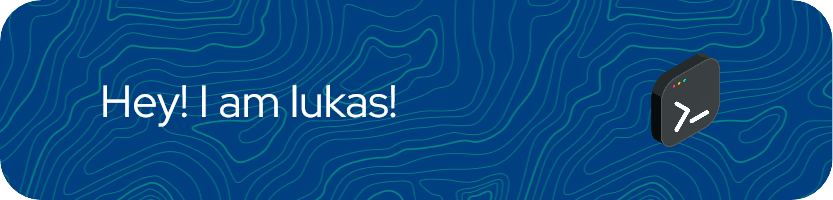

## ♟️ About Me
I'm a tech enthusiast and IT-science student with a passion for cyber security and chess.

I am currently working on my portfolio: https://my-portfolio-flame-five.vercel.app/

## 🛠 Skills + tools I use

## 🏆 Badges and achievments

Add badges from somewhere like: [shields.io](https://shields.io/)

    
    

## 🗺 Roadmap (what I want to learn)

## 🗿 Stats

## 🔗 Social

   
   
   
  
   
   
   
  <a href="https://discord.com/users/604793540395925536"></a
   
     
     
     
    

### Feel free to contact me if you need anything!
